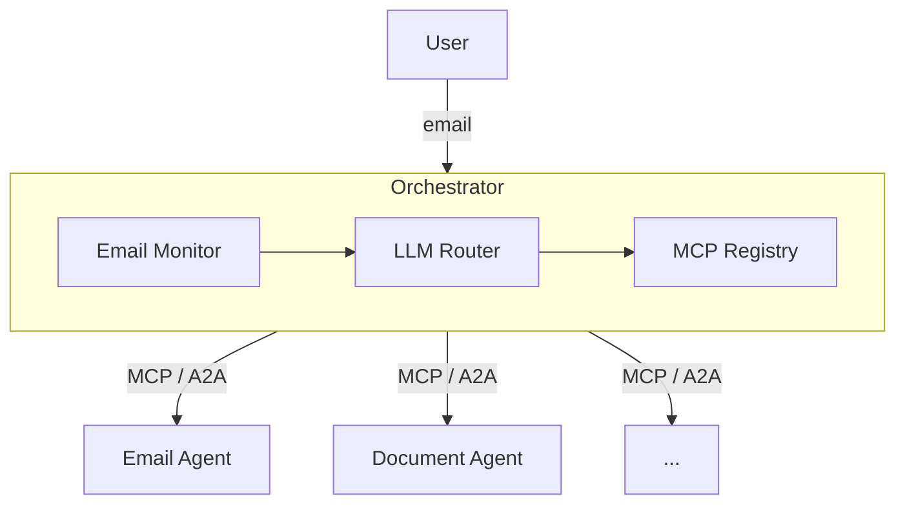

# Semos Agentura

A modular multi-agent system for professional and scientific workflows, built on open protocols -[MCP](https://modelcontextprotocol.io/) (Model Context Protocol) and [A2A](https://a2a-protocol.org/) (Agent-to-Agent Protocol).

## Principles

**Sovereign architecture.** Every agent is an independent service with its own deployment, lifecycle, and data. No central runtime owns agent state. Agents communicate exclusively through standardized protocols - neverthrough shared memory, databases, or framework internals. An organization can host its own agents on its own infrastructure, choose its own LLM providers, and retain full control over data flow.

**Federated by design.** Agents are discovered via A2A Agent Cards and connected via protocol, not configuration. A new agent joins the system by publishing its capabilities - nocentral registry to update, no monolith to redeploy. This extends across organizational boundaries: a partner institution can expose its own agents over A2A without granting access to its internal systems.

**Modular composition.** Each agent encapsulates a single domain (email, documents, etc.) and exposes it as MCP tools (for LLM-driven use) and A2A skills (for programmatic workflows). The shared `agentura-commons` library provides only protocol wiring - nobusiness logic, no framework lock-in. Agents are plain Python packages that work standalone, with or without the multi-agent layer.

**Open standards, no vendor lock-in.** MCP and A2A are both Linux Foundation standards (under [AAIF](https://aaif.dev/)) with multi-vendor support. LLM providers are interchangeable via `litellm`. Agents run as standard HTTP services - deployablewith uvicorn, Docker, Kubernetes, or any infrastructure.

**Research-grade extensibility.** The system is designed for scientific and engineering environments where workflows evolve rapidly. Adding a new capability means adding a new agent - notmodifying existing ones. Domain experts can build agents in isolation and integrate them without understanding the orchestration layer.

## How It Compares

| | **Semos Agentura** | **OpenClaw / NemoClaw** | **LibreChat** | **LangGraph / CrewAI** |
|---|---|---|---|---|
| **Model** | Independent agents, protocol-connected | One agent, many plugins (skills) | Chat UI with tool integrations | Framework-managed agent graphs |
| **Agent independence** | Each agent is its own service, deployment, repo | Plugins run inside a single process | N/A (not an agent system) | Agents are nodes in a framework runtime |
| **Protocol** | MCP + A2A (open standards) | Proprietary skill API; MCP/A2A via community plugins | MCP client only | Framework-internal; MCP via integration |
| **LLM control** | Bring your own (any provider via litellm) | Configurable per agent | Configurable per chat | Configurable but framework-coupled |
| **Data sovereignty** | Full - agentsrun on your infra, no shared state | Partial - pluginsshare the agent's process/memory | Full (self-hosted) | Depends on deployment |
| **Federation** | Native - agentsdiscover each other via A2A Agent Cards | No - single-instance | No - single-instance | No |
| **File handling** | Download URLs + base64 input; middleware spec for future clients | Via plugin | [Not solved](https://github.com/danny-avila/LibreChat/issues/8060) for MCP tools | Framework-dependent |
| **Best for** | Multi-domain professional/scientific automation | Personal AI assistant | Multi-provider chat UI | Prototyping complex agent workflows |

**Why not just use OpenClaw?** OpenClaw is a personal assistant - oneagent with plugins. Agentura is a distributed system - independentagents that can run on different machines, be developed by different teams, and communicate over standard protocols. OpenClaw could serve as a future chat frontend (via A2A) to the Agentura backend.

**Why not just use LibreChat?** LibreChat is a chat UI, not an agent system. We use it for MCP testing today. It connects to our agents as an MCP client, but it doesn't orchestrate multi-agent workflows, handle agent-to-agent communication, or manage file transfer between tools.

**Why not LangGraph/CrewAI?** These frameworks are designed for building new agents from scratch. Our agents already exist with clean APIs. Wrapping them with standard protocols (MCP + A2A) is simpler and preserves their independence - noframework runtime to adopt, no vendor lock-in.

## Architecture



Each agent is a FastAPI app exposing both protocols:
- **MCP** - LLM selects and calls agent tools (tool-use pattern)
- **A2A** - agents invoke each other directly in workflows (no LLM needed)

## Agents

| Agent | Port | Description |
|-------|------|-------------|
| **email-agent** | 8001 | Email + calendar - search, read, send, draft, reply (IMAP/COM/Graph) |
| **document-agent** | 8002 | Document processing - OCRdigest, compose, diagrams, form fill |
| **orchestrator** | 8000 | Email UI + LLM routing + workflow engine (planned) |

## Quick Start

```bash
# Prerequisites: Python 3.13+, uv
# Install: https://docs.astral.sh/uv/getting-started/installation/

# Install all workspace packages
uv sync --all-packages

# Run an agent
uv run uvicorn email_agent.service:app --port 8001
uv run uvicorn document_agent.service:app --port 8002
```

### Endpoints per Agent

| Endpoint | Protocol | Description |
|----------|----------|-------------|
| `GET /health` | HTTP | Health check |
| `GET /mcp/sse` | MCP | SSE stream for MCP clients (Claude Desktop, etc.) |
| `POST /mcp/messages/` | MCP | Tool call messages |
| `GET /.well-known/agent-card.json` | A2A | Agent Card (capabilities, skills) |
| `POST /a2a` | A2A | JSON-RPC task endpoint |

### Connect from Claude Desktop

Add to your Claude Desktop MCP config:

```json
{
  "mcpServers": {
    "email-agent": {
      "url": "http://localhost:8001/mcp/sse"
    },
    "document-agent": {
      "url": "http://localhost:8002/mcp/sse"
    }
  }
}
```

### Connect from LibreChat (Docker)

A local [LibreChat](https://www.librechat.ai/) instance can connect to agents running on the host via `host.docker.internal`. See `../librechat/` for the pre-configured stack.

```yaml
# librechat.yaml
mcpServers:
  email-agent:
    type: sse
    url: http://host.docker.internal:8001/mcp/sse
  document-agent:
    type: sse
    url: http://host.docker.internal:8002/mcp/sse
```

> **Note:** MCP's DNS rebinding protection is disabled in dev (`enable_dns_rebinding_protection=False` in `mcp_server.py`) so Docker containers can reach host-network agents. Re-enable with proper `allowed_hosts`/`allowed_origins` in production.

## Project Structure

```
semos-agentura/
  pyproject.toml              # uv workspace root
  agentura-commons/           # Shared MCP + A2A base classes
    src/agentura_commons/
      base.py                 # BaseAgentService ABC, ToolDef, SkillDef
      mcp_server.py           # FastMCP server factory
      a2a_server.py           # A2A Agent Card + handler factory
      transport.py            # Unified FastAPI app (MCP SSE + A2A + /health)
      settings.py             # CommonSettings base
  email-agent/                # Email + calendar agent
    src/email_agent/
      service.py              # MCP+A2A wrapper (9 tools, 1 skill)
      backend.py              # EmailBackend protocol (IMAP, COM, Graph)
      tools.py                # Tool definitions + executor
      mailgent.py             # LLM email agent
  document-agent/             # Document processing agent
    src/document_agent/
      service.py              # MCP+A2A wrapper (5 tools, 1 skill)
      digestion/              # OCR to Markdown
      composition/            # Markdown to PDF/PPTX/DOCX/HTML
      forms/                  # PDF/DOCX form inspection and filling
  orchestrator/               # (planned) Email UI + LLM routing
```

## Adding a New Agent

1. Create a folder `my-agent/` with `pyproject.toml` and `src/my_agent/`
2. Add `"agentura-commons"` as a dependency with `workspace = true`
3. Implement `BaseAgentService` in `src/my_agent/service.py`
4. Add to workspace members in root `pyproject.toml`
5. `uv sync --all-packages`

```python
from agentura_commons import BaseAgentService, ToolDef, SkillDef, create_app

class MyAgentService(BaseAgentService):
    @property
    def agent_name(self) -> str:
        return "My Agent"

    @property
    def agent_description(self) -> str:
        return "Does something useful."

    def get_tools(self) -> list[ToolDef]:
        return [
            ToolDef(name="my_tool", description="...", fn=self._my_tool),
        ]

    def get_skills(self) -> list[SkillDef]:
        return [SkillDef(id="my-skill", name="My Skill", description="...")]

    async def execute_skill(self, skill_id, message, *, task_id=None) -> str:
        return "result"

    async def _my_tool(self, param: str) -> str:
        return f"Result: {param}"

app = create_app(MyAgentService())
```

## Configuration

Each agent loads `.env` from its own directory, falling back to the workspace root `.env` for shared keys.

```
semos-agentura/
  .env                    # Shared: ANTHROPIC_API_KEY, AZURE_API_KEY, ...
  email-agent/.env        # IMAP_HOST, EMAIL_ADDRESS, AZURE_CLIENT_ID, ...
  document-agent/.env     # DOCUMENT_AI_*, DIAGRAM_CODEGEN_*, ...
```

## Protocols

### MCP (Model Context Protocol)

Used when an **LLM decides** which tool to call. The orchestrator's LLM sees all agent tools and selects the right one based on the user's request.

### A2A (Agent-to-Agent Protocol)

Used when **code/workflows decide** - cronjobs, deterministic pipelines, or when you need streaming progress updates for long-running tasks.

Both protocols are served by every agent. The caller picks which one to use.

## License

**Dual-licensed.** The core infrastructure is open source, specialized agents may be commercial.

| Component | License |
|-----------|---------|
| `agentura-commons` | Apache 2.0 |
| `agentura-ui` | Apache 2.0 |
| `email-agent` | Apache 2.0 |
| `document-agent` | Apache 2.0 |
| Future specialized agents | May be commercial (per-agent license) |

See [LICENSE](LICENSE) for the full Apache 2.0 text. Individual agents may override with their own license file.
