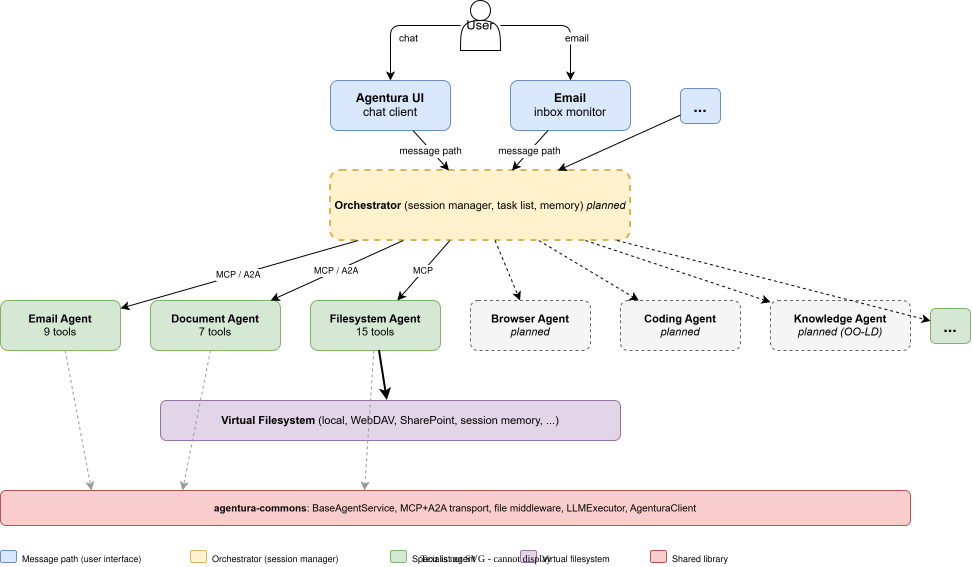

# Semos Agentura

A modular multi-agent system for professional and scientific workflows, built on open protocols - [MCP](https://modelcontextprotocol.io/) (Model Context Protocol) and [A2A](https://a2a-protocol.org/) (Agent-to-Agent Protocol).

## Principles

**Sovereign architecture.** Every agent is an independent service with its own deployment, lifecycle, and data. No central runtime owns agent state. Agents communicate exclusively through standardized protocols - never through shared memory, databases, or framework internals. An organization can host its own agents on its own infrastructure, choose its own LLM providers, and retain full control over data flow.

**Federated by design.** Agents are discovered via A2A Agent Cards and connected via protocol, not configuration. A new agent joins the system by publishing its capabilities - no central registry to update, no monolith to redeploy. This extends across organizational boundaries: a partner institution can expose its own agents over A2A without granting access to its internal systems.

**Modular composition.** Each agent encapsulates a single domain and exposes it as MCP tools (for LLM-driven use) and A2A skills (for programmatic workflows). The shared `agentura-commons` library provides only protocol wiring - no business logic, no framework lock-in. Agents are plain Python packages that work standalone, with or without the multi-agent layer.

**Open standards, no vendor lock-in.** MCP and A2A are both Linux Foundation standards (under [AAIF](https://aaif.io/)) with multi-vendor support. LLM providers are interchangeable via `litellm`. Agents run as standard HTTP services - deployable with uvicorn, Docker, Kubernetes, or any infrastructure.

**Research-grade extensibility.** The system is designed for scientific and engineering environments where workflows evolve rapidly. Adding a new capability means adding a new agent - not modifying existing ones.

## Components

### Core Infrastructure

| Component | Description | Status |
|-----------|-------------|--------|
| **[agentura-commons](agentura-commons/)** | Shared framework: BaseAgentService, MCP+A2A transport, file middleware, LLMExecutor (universal agentic loop), reference client (AgenturaClient) | Done |
| **[Virtual Filesystem](filesystem-agent/src/filesystem_agent/vfs.py)** | Unified API for local, WebDAV, SharePoint, and in-memory backends via fsspec. Single namespace for all file operations. | Done |
| **[File Middleware](docs/file-handling-spec.md)** | Symmetric LLM file handling: the LLM only sees symbolic filenames. Client middleware resolves names to base64/URL on input, fetches download URLs and registers files on output. Based on the Virtual Filesystem. | Done |
| **[Orchestrator](docs/agent-architecture.md)** | Multi-session manager that can run independently in background. Operates on the virtual filesystem, maintains task lists and memory, spawns sub-agents. Email and UI are message paths into shared sessions. | Planned |

### User Interfaces

| Component | Description | Status |
|-----------|-------------|--------|
| **[Agentura UI](agentura-ui/)** | Multi-session, multi-model chat UI. Visualizes orchestrator state and is itself one message path into the orchestrator. Built on [panelini](https://github.com/opensemanticworld/panelini). | Partial |
| **[Email Agent](email-agent/)** (as channel) | Second message path: incoming emails create/resume orchestrator sessions, replies go back via email. Uses `@mailgent` tagging. | Partial |

### Specialist Agents

| Agent | Description | Tools | Status |
|-------|-------------|-------|--------|
| **[Filesystem Agent](filesystem-agent/)** | File operations on the Virtual Filesystem: read, write, edit, copy, move, search, glob, archive browsing across all backends. | 15 | Done |
| **[Document Agent](document-agent/)** | Non-plaintext document processing: OCR digest (PDF, images, Office), compose (Markdown to PDF/PPTX/DOCX/HTML), diagram generation (Mermaid, draw.io), form inspection and filling (PDF/DOCX). | 7 | Done |
| **[Email Agent](email-agent/)** | Email and calendar operations: search, read, draft, reply, send. Calendar events and free slot computation. Backends: IMAP/SMTP, Outlook COM, MS Graph API. | 9 | Done |
| **Browser Agent** | Web-based retrieval and website automation via Playwright. Visual navigation, data extraction, form filling on live websites. | - | Planned |
| **Coding Agent** | Write and execute program code. File exchange via file middleware. Code review, test generation. | - | Planned |
| **Knowledge Agent** | Long-term memory with retrieve, patch, and auto-consolidation. Based on [Object-Oriented Linked Data (OO-LD)](https://github.com/OO-LD). Knowledge graph with semantic search. | - | Planned |

### Architecture



> Editable source: [docs/architecture.drawio](docs/architecture.drawio)

Each agent is a FastAPI app exposing both protocols:
- **MCP** at `/mcp/sse` - LLM selects and calls agent tools (tool-use pattern)
- **A2A** at `/a2a` (REST) and `/a2a/rpc` (JSON-RPC) - agents invoke each other or receive delegated tasks with full task lifecycle

## How It Compares

| | **Semos Agentura** | **OpenClaw / NemoClaw** | **LibreChat** | **LangGraph / CrewAI** |
|---|---|---|---|---|
| **Model** | Independent agents, protocol-connected | One agent, many plugins (skills) | Chat UI with tool integrations | Framework-managed agent graphs |
| **Agent independence** | Each agent is its own service, deployment, repo | Plugins run inside a single process | N/A (not an agent system) | Agents are nodes in a framework runtime |
| **Protocol** | MCP + A2A (open standards) | Proprietary skill API; MCP/A2A via community plugins | MCP client only | Framework-internal; MCP via integration |
| **LLM control** | Bring your own (any provider via litellm) | Configurable per agent | Configurable per chat | Configurable but framework-coupled |
| **Data sovereignty** | Full - agents run on your infra, no shared state | Partial - plugins share the agent's process/memory | Full (self-hosted) | Depends on deployment |
| **Federation** | Native - agents discover each other via A2A Agent Cards | No - single-instance | No - single-instance | No |
| **File handling** | Symmetric middleware ([spec](docs/file-handling-spec.md)), LLM never sees binary | Via plugin | [Not solved](https://github.com/danny-avila/LibreChat/issues/8060) for MCP tools | Framework-dependent |
| **Best for** | Multi-domain professional/scientific automation | Personal AI assistant | Multi-provider chat UI | Prototyping complex agent workflows |

**Why not just use OpenClaw?** OpenClaw is a personal assistant - one agent with plugins. Agentura is a distributed system - independent agents that can run on different machines, be developed by different teams, and communicate over standard protocols. OpenClaw could serve as a future chat frontend (via A2A) to the Agentura backend.

**Why not just use LibreChat?** LibreChat is a chat UI, not an agent system. We use it for MCP testing. It connects to our agents as an MCP client, but it doesn't orchestrate multi-agent workflows, handle agent-to-agent communication, or manage file transfer between tools.

**Why not LangGraph/CrewAI?** These frameworks are designed for building new agents from scratch. Our agents already exist with clean APIs. Wrapping them with standard protocols (MCP + A2A) is simpler and preserves their independence - no framework runtime to adopt, no vendor lock-in.

## Quick Start

```bash
# Prerequisites: Python 3.13+, uv
# Install: https://docs.astral.sh/uv/getting-started/installation/

# Install all workspace packages
uv sync --all-packages

# Start all agents + UI
uv run python run_local.py

# Or run individual agents
uv run uvicorn email_agent.service:app --port 8001
uv run uvicorn document_agent.service:app --port 8002
```

### Endpoints per Agent

| Endpoint | Protocol | Description |
|----------|----------|-------------|
| `GET /health` | HTTP | Health check |
| `GET /mcp/sse` | MCP | SSE stream for MCP clients (Claude Desktop, etc.) |
| `POST /mcp/messages/` | MCP | Tool call messages |
| `GET /.well-known/agent-card.json` | A2A | Agent Card (capabilities, skills) |
| `POST /a2a` | A2A | REST endpoint (HTTP+JSON) |
| `POST /a2a/rpc` | A2A | JSON-RPC endpoint |

### Connect from Claude Desktop

```json
{
  "mcpServers": {
    "email-agent": { "url": "http://localhost:8001/mcp/sse" },
    "document-agent": { "url": "http://localhost:8002/mcp/sse" }
  }
}
```

## Adding a New Agent

1. Create `my-agent/` with `pyproject.toml` and `src/my_agent/`
2. Add `"agentura-commons"` as a dependency with `workspace = true`
3. Implement `BaseAgentService` in `service.py`
4. Add to workspace members in root `pyproject.toml`
5. `uv sync --all-packages`

```python
from agentura_commons import BaseAgentService, ToolDef, SkillDef, create_app

class MyAgentService(BaseAgentService):
    @property
    def agent_name(self) -> str:
        return "My Agent"

    @property
    def agent_description(self) -> str:
        return "Does something useful."

    def get_tools(self) -> list[ToolDef]:
        return [ToolDef(name="my_tool", description="...", fn=self._my_tool)]

    def get_skills(self) -> list[SkillDef]:
        return [SkillDef(id="my-skill", name="My Skill", description="...")]

    async def execute_skill(self, skill_id, message, *, task_id=None) -> str:
        return "result"

    async def _my_tool(self, param: str) -> str:
        return f"Result: {param}"

app = create_app(MyAgentService())
```

## Configuration

Each agent loads `.env` from its own directory, falling back to the workspace root `.env` for shared keys.

```
semos-agentura/
  .env                    # Shared: ANTHROPIC_API_KEY, AZURE_API_KEY, ...
  email-agent/.env        # IMAP_HOST, EMAIL_ADDRESS, ...
  document-agent/.env     # DOCUMENT_AI_*, DIAGRAM_CODEGEN_*, ...
```

## Protocols

### MCP (Model Context Protocol)

Used when an **LLM decides** which tool to call. The orchestrator's LLM sees all agent tools and selects the right one based on the user's request. Tools return normalized results (str, dict, Path, file-like objects are all auto-converted to `CallToolResult` with `ResourceLink` and `structuredContent`).

### A2A (Agent-to-Agent Protocol)

Used for **high-level delegation** - the requesting LLM sends a natural language task to an agent's LLM, which plans and executes it using its own tools. Also used for deterministic pipelines and cron workflows (no LLM needed).

Each agent exposes dual A2A bindings: REST (`/a2a`) and JSON-RPC (`/a2a/rpc`). The `LLMExecutor` in agentura-commons provides the universal agentic loop with 5 synthetic tools (`request_input`, `return_result`, `report_progress`, `reject_task`, `request_auth`) that map to A2A task states.

Both protocols are served by every agent. The caller picks which one to use.

## Testing

```bash
# CI tests (no external deps - mocked backends, no LLM/COM/pandoc)
cd agentura-commons && uv run pytest tests/ -m "not integration"
cd email-agent && uv run pytest tests/ -m "not integration"
cd document-agent && uv run pytest tests/ -m "not integration"
cd filesystem-agent && uv run pytest tests/ -m "not integration"

# Integration tests (needs real backends)
uv run pytest -m integration
```

Pre-commit hook enforces ruff lint + format.

## Documentation

- [File Handling Specification](docs/file-handling-spec.md) - how files flow between LLMs and tools
- [Agent Architecture Reference](docs/agent-architecture.md) - patterns, tool system, synthetic tools, protocols

## License

**Dual-licensed.** The core infrastructure is open source, specialized agents may be commercial.

| Component | License |
|-----------|---------|
| `agentura-commons` | Apache 2.0 |
| `agentura-ui` | Apache 2.0 |
| `email-agent` | Apache 2.0 |
| `document-agent` | Apache 2.0 |
| `filesystem-agent` | Apache 2.0 |
| Future specialized agents | May be commercial (per-agent license) |

See [LICENSE](LICENSE) for the full Apache 2.0 text. Individual agents may override with their own license file.
