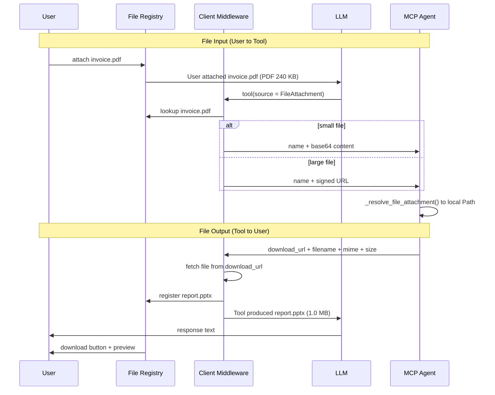
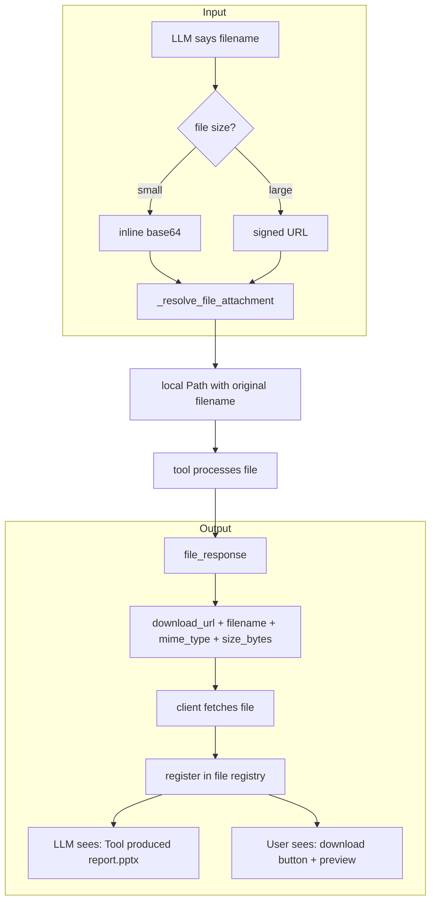

# File Handling Specification for MCP/A2A Chat Clients

> Status: Draft v2 - March 2026
> Context: Semos Agentura agents need to exchange files with chat UIs.
> Neither MCP nor any chat client handles this well today.

## Problem

MCP tools that process or produce files (OCR, document composition, form filling, diagrams) need to:
1. **Receive** files from the user (input)
2. **Return** files to the user (output)

No MCP chat client (Claude Desktop, LibreChat, Cherry Studio, OpenCode) supports either direction reliably as of March 2026.

## Design Principle: The LLM Never Touches Binary Data

The LLM works with **file references** (names, IDs). A **client middleware layer** handles all binary serialization - injecting file content into tool calls before they reach the server, and extracting file content from tool results before they reach the LLM.

This is analogous to how Anthropic's API handles images: the client injects `image` blocks with base64 into the request; the LLM never generates base64 itself.



## Specification

### 1. File Registry

The chat client MUST maintain a **file registry** - a mapping of file references to stored blobs.

```
Registry:
  "invoice.pdf"   -> {blob, mime: "application/pdf", size: 245760, source: "upload"}
  "report.pptx"   -> {blob, mime: "application/vnd...", size: 1048576, source: "tool:compose_document"}
```

Entries are added when:
- User attaches a file to a message
- A tool result contains a file (download_url, EmbeddedResource, or FilePart)

Entries are presented to the LLM as short text references, never as binary content.

### 2. FileAttachment Type

File parameters use a structured `FileAttachment` type shared across all agents (defined in `agentura-commons`):

```python
class FileAttachment(TypedDict):
    name: str      # Original filename (e.g. "invoice.pdf")
    content: str   # File path, base64 string, or data URI
```

The MCP JSON Schema for a `FileAttachment` parameter:

```json
{
  "$defs": {
    "FileAttachment": {
      "properties": {
        "name": {"type": "string", "title": "Name"},
        "content": {"type": "string", "title": "Content"}
      },
      "required": ["name", "content"],
      "type": "object"
    }
  },
  "source": {
    "anyOf": [
      {"$ref": "#/$defs/FileAttachment"},
      {"type": "string"}
    ],
    "x-file": true
  }
}
```

Parameters accept both `FileAttachment` objects and plain strings (backward compatible with path-only usage).

The `x-file: true` JSON Schema extension (per [JSON Schema vendor extensions](https://json-schema.org/draft/2020-12/json-schema-core#section-6.5)) tells the middleware: "when the LLM puts a filename here, resolve it from the file registry before sending to the tool."

For array parameters (e.g. email attachments):

```json
{
  "attachments": {
    "type": "array",
    "items": {"$ref": "#/$defs/FileAttachment"},
    "x-file": true
  }
}
```

### 3. Symmetric Middleware Design

Both directions - input and output - follow the same pattern. Each side has middleware that decides **independently** how to transport the file: inline base64 or URL. The decision is based on file size, network topology, and capabilities.



**Neither middleware is required.** The system degrades gracefully:
- No client middleware -> LLM sees raw URL -> user clicks link manually
- No agent middleware -> tool returns URL only -> still works
- Both present -> seamless: LLM sees filenames, user sees previews/downloads

### 4. File Input (User -> Tool)

#### 4.1 What the LLM sees

```
User attached: invoice.pdf (PDF, 240 KB)
User: "Please inspect the form fields in this document"
```

The LLM calls the tool with a **FileAttachment**:

```json
{
  "name": "inspect_form",
  "arguments": {
    "file_path": {"name": "invoice.pdf", "content": "invoice.pdf"}
  }
}
```

The LLM puts the registry filename in both `name` and `content`. The middleware resolves `content` before it reaches the agent.

#### 4.2 Client middleware decides transport

| Condition | Transport | What the tool receives |
|-----------|-----------|----------------------|
| File <= threshold (e.g. 10 MB) | Inline base64 | `{name: "invoice.pdf", content: "data:application/pdf;base64,..."}` |
| File > threshold | Signed URL | `{name: "invoice.pdf", content: "https://client/staging/abc?token=xyz"}` |
| Same machine (fallback) | Local path | `{name: "invoice.pdf", content: "/staging/user-42/invoice.pdf"}` |

The threshold is a client configuration.

#### 4.3 Agent resolves

The tool's `_resolve_file_attachment()` handles both `FileAttachment` dicts and plain strings:
- `FileAttachment` -> extracts `name` and `content`, resolves content, writes temp file preserving original filename
- Plain string -> resolves as path, base64, or data URI (backward compatible)

Filename preservation matters for:
- Email attachments (recipient sees the name)
- Format inference (`.pdf` vs `.docx` vs `.png`)
- User-facing output filenames

### 5. File Output (Tool -> User)

#### 5.1 Tool response format

All file-producing tools return a consistent response via `BaseAgentService.file_response()`:

```json
{
  "download_url": "http://agent:8002/files/a3f1c2d0_report.pptx",
  "filename": "report.pptx",
  "mime_type": "application/vnd.openxmlformats-officedocument.presentationml.presentation",
  "size_bytes": 1048576
}
```

Files on disk use UUID-prefixed names for security. The `filename` field carries the display name.

#### 5.2 Client middleware registers the file

1. Detects `download_url` in tool result
2. Fetches the file content from the URL
3. Registers in file registry: `"report.pptx" -> {blob, mime, size, source: "tool"}`
4. Replaces the tool result for the LLM:

```
Tool produced: report.pptx (PowerPoint, 1.0 MB)
```

#### 5.3 What the user sees

| MIME type | Rendering |
|-----------|-----------|
| `image/*` | Inline image |
| `text/html` | Sandboxed iframe |
| `application/pdf` | PDF viewer or download button |
| `audio/*`, `video/*` | Media player |
| Other | Download button with icon + filename + size |

### 6. Inline Size Limits

| Context | Max inline (base64) | Larger files |
|---------|:------------------:|:------------:|
| MCP tool input (middleware -> tool) | 10 MB | Signed URL |
| MCP tool output (tool -> middleware) | No limit on download_url | Middleware fetches on demand |
| MCP EmbeddedResource (if used) | 1 MB | URI-only |
| A2A FilePart (agent-to-agent) | No limit | URI preferred for >10 MB |
| LLM context | **0 bytes** | LLM only sees filenames |

The key insight: **the LLM context window is not a constraint** because binary data never enters it.

### 7. A2A File Transfer

For agent-to-agent communication (no user in the loop), use A2A's native `FilePart`:

```json
{
  "type": "file",
  "file": {
    "name": "report.pptx",
    "mimeType": "application/vnd.openxmlformats-officedocument.presentationml.presentation",
    "bytes": "<base64>"
  }
}
```

Or by URI reference (preferred for large files):

```json
{
  "type": "file",
  "file": {
    "name": "report.pptx",
    "mimeType": "application/vnd.openxmlformats-officedocument.presentationml.presentation",
    "uri": "http://document-agent:8002/files/a3f1c2d0_report.pptx"
  }
}
```

A2A `FilePart` is preferred over MCP `EmbeddedResource` for agent-to-agent because:
- First-class type (not bolted onto tool results)
- Supports both inline and URI natively
- Part of the task lifecycle (can stream chunks)
- No size constraints from LLM context

### 8. Security

#### Download URLs
- MUST use UUID/random tokens in the path (not guessable filenames)
- SHOULD be time-limited (signed URL or server-side TTL)
- MUST be scoped to the requesting user/session in multi-user deployments
- MUST use HTTPS in production

#### File Registry
- Entries MUST be scoped per user/session
- Entries SHOULD have a configurable TTL (default: 1 hour)
- The registry MUST NOT persist across sessions unless explicitly configured

#### Staging Area
- Uploaded files MUST be isolated per user
- Files MUST be deleted after the configured TTL
- Maximum upload size SHOULD be configurable (default: 50 MB)

### 9. Implementation Checklist

#### Agent side (agentura-commons + agents)

- [x] `FileAttachment` TypedDict in `agentura-commons` (shared)
- [x] `_resolve_file()` accepts path, base64, and data URI
- [x] `_resolve_file_attachment()` accepts `FileAttachment` or plain string, preserves filename
- [x] File-producing tools return `download_url` + `filename` + `mime_type` + `size_bytes`
- [x] `file_response()` helper in `BaseAgentService` for consistent output
- [x] Output files use UUID-prefixed names on disk
- [x] `/files/` static endpoint serves output directory
- [x] `x-file: true` schema annotation on file parameters
- [x] `file_params` on `ToolDef` to declare which params accept files
- [x] Auto-cleanup of output files older than 24h on startup
- [ ] Return `EmbeddedResource` for small files alongside download URL
- [ ] A2A `FilePart` responses for agent-to-agent
- [ ] Signed/expiring download URLs (production)
- [ ] Per-user file isolation (multi-user production)

#### Chat client middleware (agentura-ui)

- [x] File registry (upload tracking + tool output tracking)
- [x] Pre-processing: resolve file references -> base64/URL before tool call
- [x] Post-processing: detect download_url -> fetch -> register -> replace with text reference
- [x] Schema-driven: use `x-file` annotation to identify file parameters
- [x] Render files from registry as downloads/previews in UI
- [x] File attachment UI with drag-and-drop
- [x] Inline rendering for images and markdown references
- [ ] Signed URL support for large files (>10 MB)

### 10. Protocol Comparison

| Capability | MCP (today) | MCP + Middleware | A2A |
|-----------|:-----------:|:---------------:|:---:|
| File input to tool | Path only | `FileAttachment` {name, content} | `FilePart` in message |
| File output from tool | Text with URL | URL -> registry -> preview | `FilePart` in artifact |
| Filename preserved | No | Yes (via `FileAttachment.name`) | Yes (via `FilePart.name`) |
| LLM sees binary data | Yes (broken) | **Never** | N/A |
| Streaming large files | No | No | Yes (chunked artifacts) |
| File metadata | No standard | `mime_type` + `size_bytes` | In `FilePart` |
| Client support needed | Major changes | Middleware only | New protocol support |

### 11. References

- [MCP Resources spec (2025-11-25)](https://modelcontextprotocol.io/specification/2025-11-25/server/resources)
- [A2A FilePart spec](https://a2a-protocol.org/latest/specification/)
- [LibreChat #8060 - Temporary file links for MCP](https://github.com/danny-avila/LibreChat/issues/8060)
- [LibreChat #10742 - File paths for MCP tools](https://github.com/danny-avila/LibreChat/discussions/10742)
- [Claude Desktop EmbeddedResource bug](https://github.com/modelcontextprotocol/csharp-sdk/issues/1261)
- [Goose #2917 - EmbeddedResource download](https://github.com/block/goose/issues/2917)
- [Claude Code #9152 - MCP image token limit](https://github.com/anthropics/claude-code/issues/9152)
- [MCP Apps extension (Jan 2026)](https://blog.modelcontextprotocol.io/posts/2026-01-26-mcp-apps/)
- [JSON Schema vendor extensions](https://json-schema.org/draft/2020-12/json-schema-core#section-6.5)
